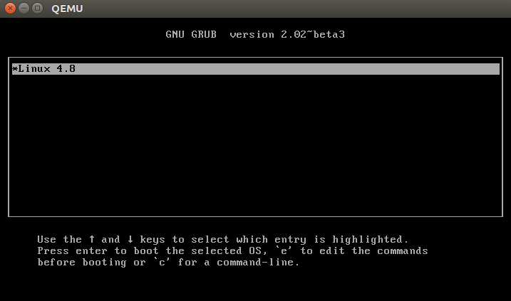

# Let's Build a Linux Distribution from Scratch

### Usage
- Build linux kernel
```bash
  cd linux
  make O=build/linux menuconfig
  make bzImage -j8
```
- Build busybox
```bash
  cd busybox
  # Enable static link
  make O=build/busybox menuconfig
  make -j8
  make install
```

- Build initrd
```bash
  cd root
  ./makeinitrd
```

- Run qemu to start my linux distro
```bash
  ./run-qemu.sh
```
- Now, we have a linux shell.

### Day 1, let's run a shabby shell with busybox simply on linux kernel with qemu.
As far as I know, qemu supports `-kernel bzImage`, so we can start a plain old linux kernel on qemu. Let's run it.
```bash
  qemu-system-x86_64 -kernel bzImage
  # ...
  # [    0.904057] ---[ end Kernel panic - not syncing: VFS: Unable to mount root fs on unknown-block(0,0)
```
It fails because VFS cannot find root fs. That is to say, it can't find `/`, so it doesn't know where to find the `init` script.

So next, we attach a virtual hard disk to the machine using qemu's `-hda` and tell the kernel root fs is on the first harddisk with `-append root=/dev/sda`. Normally, on Ubuntu or other linux distribution, this is done by grub.

But firstly, we need a raw hard disk image.

###### Let's create a raw disk image for linux
```bash
  # Create a 4MiB empty file 
  dd if=/dev/zero of=hda.img bs=1024 count=4096

  # Setup loop device, this device acts as a physical disk with the content of `hda.img`
  losetup /dev/loop0 hda.img
  # Format the disk as ext2/3/4
  mke2fs /dev/loop0

  # Mount the disk at `/mnt`
  mount /dev/loop0 /mnt

  # Copy the statically linked busybox to our disk
  cp -r $BUSYBOX_DIR/* /mnt/
  # Create a init script. We'll explain later.
  cp init /mnt/init
  mkdir -p /mnt/{dev,sys,proc}

  # Unmount the disk so the disk content is written to hda.img
  umount /mnt
  losetup -d /dev/loop0
```

Why would we want to create `init` script. Because after linux kernel is initiated, it will search for a file you give it and run it as the first process, pid 1. And we use this script to establish our `/proc`, `/sys` directory and start a shell(busybox).
```bash
  # /init
  #!/bin/sh

  mount -t proc proc /proc
  mount -t sysfs sys /sys

  exec /bin/sh
```

Run all of these with
```bash
  qemu-system-x86_64 -kernel build/linux/arch/x86/boot/bzImage -hda build/boot/hda.img -append "root=/dev/sda init=/init"
```
You'll see
```bash
  # / ls
  bin init lost-found sbin usr 
  ...
  # /
```
Wow! We've run a linux shell just with linux kernel and busybox now :)
Small as it is, it's actually a linux distribution.
Exciting.

### Stage 2, let's pack our linux on a single disk image.

Now we can run our linux with qemu, but we rely on qemu's `-kernel kernel` to start our kernel.
Next, we want grub to handle it. So what is the benifit? 
We can install grub on MBR, and our linux distribution only contains on disk image.
This is what most linux distributions does in the real world.

Previously, we use a kernel image `bzImage` (it's the same as vmlinuz) and a disk partition image(/dev/sda). It's a partition image so it does not have an MBR.
So first thing we need is a disk image.
We create one with `fdisk /dev/loop0`(I won't repeat how to attach image file to loop0 device).
Create a DOS MBR and a partition with command `c`, `n`, and save it with `w`.
Update system partition table with `partprobe /dev/loop0` and we have the device `/dev/loop0p1`. 
And do everything we've done to previous `/dev/loop0`, because now the partition `/dev/loop0p1` is our system partition.

Then install grub on the disk with grub-install
```bash
  grub-install --target i386-pc /dev/loop0 --boot-directory=/mnt/boot
```

Create `/mnt/boot/grub/grub.cfg` with
```
  set default=0
  set timeout=5

  set root=(hd0,msdos1)

  menuentry "Linux 4.8" {
    linux /boot/vmlinuz root=/dev/sda1 ro
  }
```
And we've done.
This time we can start qemu with
```bash
  qemu-system-x86_64 -hda build/root/hda.img
```
Here's grub.




### TODOs
- ~~grub~~
- dynamic linked(ld)
- systemd
